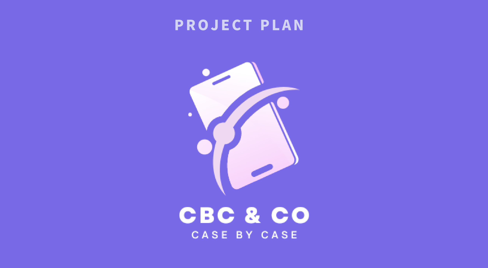

# CBC_PROJECT
### 스마트폰 케이스 제조업 
### SCM FCM 업무 통합 및 S4 HA/NA 구축

 

---

---
# 프로젝트 구성원

<table>
<thead>
<tr>
<th style="text-align:center"><strong>PM</strong></th>
<th style="text-align:center"><strong>PL</strong></th>
</tr>
</thead>
<tbody>
<tr>
<td style="text-align:center">홍지희</td>
<td style="text-align:center">강민구</td>
<td style="text-align:center">고상준</td>
<td style="text-align:center">김다영</td>
  <td style="text-align:center">박가나</td>
<td style="text-align:center">서영태</td>
<td style="text-align:center">이아람</td>
<td style="text-align:center">허  민</td>
</tr>
</tbody>
</table>

---

# Process Flow Diagram
|CBC & CO 주요 업무 프로세스|
|:---:|
||

---

# 프로젝트 WBS

